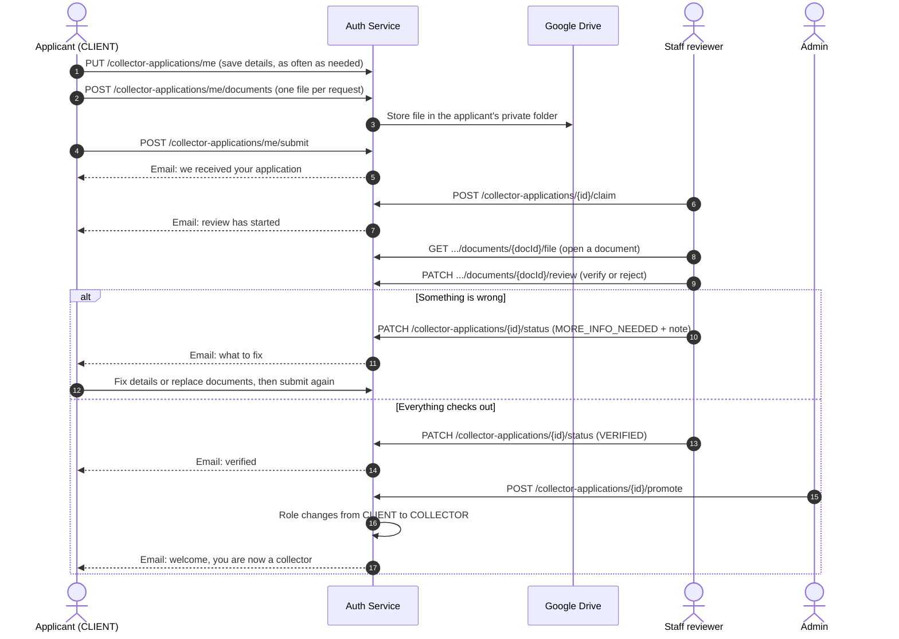
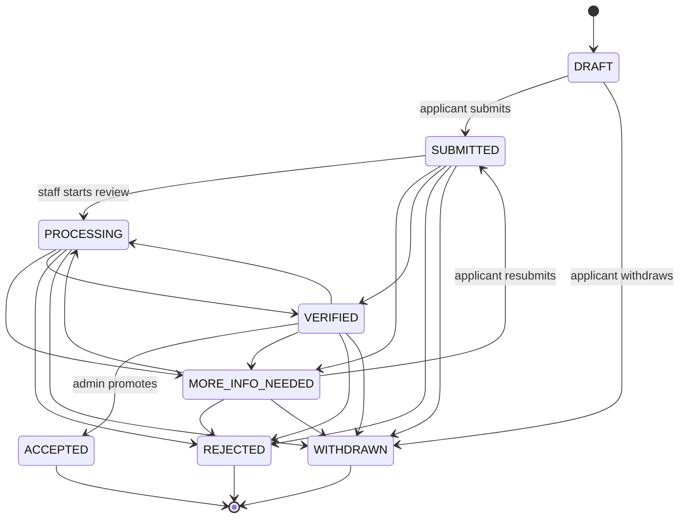

# Collector Applications

Customers who want to work as Garbigo collectors apply through the auth service. They fill in a profile, upload their documents, and submit. Staff review the application, verify each document, and an administrator promotes the applicant to a collector with one action. Every change the applicant should know about is emailed to them.

Documents (ID card or passport, driving licence, police clearance and so on) are stored in Google Drive. They are never public. Staff open them through the service, which checks their role on every request.

## Contents

- [The journey](#the-journey)
- [Statuses](#statuses)
- [Who can do what](#who-can-do-what)
- [Required documents](#required-documents)
- [Application fields](#application-fields)
- [Applicant endpoints](#applicant-endpoints)
- [Staff endpoints](#staff-endpoints)
- [Postman quick start](#postman-quick-start)
- [Emails](#emails)
- [Google Drive setup](#google-drive-setup)
- [Configuration](#configuration)
- [Error messages](#error-messages)

## The journey



## Statuses



| Status | Label the applicant sees | Meaning | Applicant can edit |
|---|---|---|---|
| `DRAFT` | Draft | Saved but not submitted yet | Yes |
| `SUBMITTED` | Submitted | Waiting for a reviewer | No |
| `PROCESSING` | In review | A staff member is checking it | No |
| `MORE_INFO_NEEDED` | More information needed | Applicant must fix something and submit again | Yes |
| `VERIFIED` | Verified | Details and all required documents are verified. Waiting for the admin to promote | No |
| `ACCEPTED` | Accepted | Promoted. The account is now a `COLLECTOR` | No |
| `REJECTED` | Not approved | Closed. The applicant can start a new application | No |
| `WITHDRAWN` | Withdrawn | The applicant cancelled. They can start a new application | No |

Rules the service enforces:

- Staff cannot set `ACCEPTED` through the status endpoint. Only `POST /collector-applications/{id}/promote` does that, because it also changes the user's role.
- `REJECTED` and `MORE_INFO_NEEDED` need a note. The applicant sees it and it goes in the email.
- `VERIFIED` is refused until every required document is verified and the applicant's details are complete. The response lists exactly what is still open.
- A person can have only one open application. After `REJECTED` or `WITHDRAWN` they can start a new one.
- An ID number (same ID type and country) cannot be used in two live applications from different accounts.

## Who can do what

| Action | CLIENT (applicant) | SUPPORT, FINANCE, OPERATIONS | ADMIN |
|---|---|---|---|
| Fill in, upload, submit, withdraw their own application | Yes | No | No |
| List, search, and open applications | No | Yes | Yes |
| Claim an application, verify or reject documents, change status, add internal notes | No | Yes | Yes |
| Promote to collector | No | No | Yes |

Users who are already a `COLLECTOR`, and staff accounts, cannot apply. They get a friendly message instead.

## Required documents

Files must be PDF, JPG or PNG, up to 5 MB each. The service checks the real file content, not just the extension.

| Document type | Label | Required when |
|---|---|---|
| `ID_FRONT` | ID document (front, or the photo page of a passport) | Always |
| `ID_BACK` | ID document (back) | Unless the ID type is `PASSPORT` |
| `PASSPORT_PHOTO` | Passport-style photo (JPG or PNG only) | Always |
| `TAX_CERTIFICATE` | Tax registration document | Optional |
| `GOOD_CONDUCT_CERTIFICATE` | Police clearance certificate | Always |
| `DRIVING_LICENCE` | Driving licence | Vehicle is motorised |
| `VEHICLE_REGISTRATION` | Vehicle registration document | Vehicle is motorised |
| `INSURANCE_CERTIFICATE` | Vehicle insurance certificate | Vehicle is motorised |
| `WASTE_PERMIT` | Waste transport permit | Service includes `SEWAGE_EXHAUSTER` |
| `PROOF_OF_ADDRESS` | Proof of address | Optional |
| `OTHER` | Other supporting document | Optional, up to 5 |

Motorised vehicles are `MOTORBIKE`, `TUKTUK`, `PICKUP_TRUCK`, `LORRY` and `EXHAUSTER_TRUCK`. `HANDCART` is not motorised. Until a vehicle type is chosen, vehicle documents are shown as optional.

Uploading the same type again replaces the old file, unless that document is already verified. Verified documents cannot be replaced or deleted by the applicant.

## Application fields

Everything is optional while saving a draft. All of it (except references and the optional items) is needed to submit. `PUT /collector-applications/me` only changes the fields you send. Send `null` or leave a field out to keep it. Send an empty string to clear a text field.

| Field | Type | Notes |
|---|---|---|
| `countryCode` | string | Two-letter country code such as `KE`, `US` or `IN`. Get the full list from `/options`. Send this first, because phone numbers are read using it |
| `idType` | string | `NATIONAL_ID`, `PASSPORT`, `RESIDENCE_PERMIT` or `OTHER_GOVERNMENT_ID` |
| `idNumber` | string | The number exactly as printed on the document. Saved in upper case |
| `taxId` | string | Optional. Any tax number format |
| `dateOfBirth` | date | `yyyy-MM-dd`. Must be 18 or older |
| `alternatePhone` | string | Any valid number. Include the country code, or leave it out to use the country above. Saved as `+254712345678` |
| `region` | string | State, province, county or region. Optional |
| `city` | string | City or town |
| `postalCode` | string | Optional |
| `physicalAddress` | string | Up to 200 characters |
| `timeZone` | string | Optional. A time zone name such as `Africa/Nairobi` or `America/Chicago` |
| `serviceTypes` | array | `GENERAL_WASTE`, `RECYCLABLES`, `ORGANIC_WASTE`, `BULK_AND_CONSTRUCTION_WASTE`, `SEWAGE_EXHAUSTER` |
| `vehicleType` | string | `HANDCART`, `MOTORBIKE`, `TUKTUK`, `PICKUP_TRUCK`, `LORRY`, `EXHAUSTER_TRUCK` |
| `vehicleRegistration` | string | Required for motorised vehicles. The number plate as printed. Saved in upper case |
| `capacityValue`, `capacityUnit` | number, string | Unit is `KILOGRAMS`, `LITRES` or `CUBIC_METRES` |
| `serviceAreas` | array of string | Up to 10 areas |
| `maxTravelDistanceKm` | integer | 1 to 200 |
| `helpersCount` | integer | 0 to 20 |
| `availableDays` | array | `MONDAY` to `SUNDAY` |
| `shiftStart`, `shiftEnd` | string | `HH:mm`, for example `06:00` |
| `availableForEmergency` | boolean | Open to urgent pickups |
| `yearsOfExperience` | integer | 0 to 60. Enter 0 for new collectors |
| `experienceSummary` | string | Up to 1000 characters |
| `languages` | array of string | Up to 8 |
| `motivation` | string | Why they want to be a collector. Up to 1000 characters |
| `payoutMethod` | string | `MOBILE_MONEY`, `BANK_ACCOUNT` or `DIGITAL_WALLET` |
| `payoutProvider` | string | The bank, wallet or mobile money provider, for example `M-Pesa`, `Chase` or `PayPal` |
| `payoutAccountNumber` | string | Account number, or the phone number for mobile money (checked and saved in international format) |
| `payoutAccountName` | string | The name on the account |
| `emergencyContact` | object | `name`, `relationship`, `phone`. All three needed to submit |
| `references` | array | Up to 3 of `name`, `relationship`, `phone`. Optional |
| `acceptedTerms` | boolean | Must be `true` to submit |
| `consentToBackgroundCheck` | boolean | Must be `true` to submit |
| `confirmsInfoIsTrue` | boolean | Must be `true` to submit |

The response always includes a `progress` block with a percentage, a plain-language `missing` list, and per-section checks. It also has `nextSteps`, so a front end can show a checklist without any logic of its own.

## Applicant endpoints

All of these need `Authorization: Bearer <token>`.

| Method | Endpoint | Purpose |
|---|---|---|
| GET | `/collector-applications/options` | Countries with dialling codes, ID types, payout methods, vehicle types, service types, days, statuses, upload limits, baseline document list |
| GET | `/collector-applications/requirements?vehicleType=PICKUP_TRUCK&serviceTypes=SEWAGE_EXHAUSTER` | Documents needed for a given vehicle and services |
| GET | `/collector-applications/me` | The applicant's current application, or the invitation to start one |
| GET | `/collector-applications/me/history` | All their past applications |
| PUT | `/collector-applications/me` | Save details. Creates the draft on first call |
| POST | `/collector-applications/me/documents` | Upload one document (`multipart/form-data`) |
| DELETE | `/collector-applications/me/documents/{documentId}` | Remove a document |
| GET | `/collector-applications/me/documents/{documentId}/file` | Open their own uploaded file |
| POST | `/collector-applications/me/submit` | Submit, or resubmit after fixes |
| POST | `/collector-applications/me/withdraw` | Withdraw. Optional body `{ "reason": "..." }` |

### GET /collector-applications/me, before applying

```json
{
    "hasApplication": false,
    "canApply": true,
    "message": "Become a Garbigo collector. The application takes about 10 minutes, and you can save your progress and come back any time.",
    "application": null,
    "checklist": [
        {
            "type": "ID_FRONT",
            "label": "ID document (front)",
            "description": "The front of your ID card or residence permit, or the photo page of your passport.",
            "tip": "Place it on a flat, plain surface in good light. All four corners should be visible.",
            "required": true,
            "multiple": false,
            "acceptedFormats": "PDF, JPG or PNG",
            "maxFileSizeMb": 5,
            "uploaded": false,
            "reviewStatus": null
        }
    ]
}
```

### PUT /collector-applications/me

```json
{
    "countryCode": "KE",
    "idType": "NATIONAL_ID",
    "idNumber": "12345678",
    "taxId": "A123456789B",
    "dateOfBirth": "1994-03-21",
    "region": "Nairobi",
    "city": "Nairobi",
    "postalCode": "00100",
    "physicalAddress": "Pipeline Estate, Block C",
    "timeZone": "Africa/Nairobi",
    "serviceTypes": ["GENERAL_WASTE", "RECYCLABLES"],
    "vehicleType": "PICKUP_TRUCK",
    "vehicleRegistration": "KDA 123A",
    "capacityValue": 1200,
    "capacityUnit": "KILOGRAMS",
    "serviceAreas": ["Embakasi", "Donholm", "Umoja"],
    "maxTravelDistanceKm": 25,
    "helpersCount": 2,
    "availableDays": ["MONDAY", "TUESDAY", "WEDNESDAY", "THURSDAY", "FRIDAY", "SATURDAY"],
    "shiftStart": "06:00",
    "shiftEnd": "17:00",
    "availableForEmergency": true,
    "yearsOfExperience": 4,
    "experienceSummary": "Four years collecting household waste in Embakasi.",
    "languages": ["English", "Kiswahili"],
    "motivation": "I want a steady, formal way to grow my business.",
    "payoutMethod": "MOBILE_MONEY",
    "payoutProvider": "M-Pesa",
    "payoutAccountNumber": "0712345678",
    "payoutAccountName": "John Wanjiku",
    "emergencyContact": { "name": "Jane Wanjiku", "relationship": "Sister", "phone": "+254700111222" },
    "references": [
        { "name": "Peter Otieno", "relationship": "Estate chairman", "phone": "+254722333444" }
    ],
    "acceptedTerms": true,
    "consentToBackgroundCheck": true,
    "confirmsInfoIsTrue": true
}
```

Response (shortened):

```json
{
    "id": "6710f2c1a4b2c93d5e8f1a20",
    "referenceNumber": "GCA-2026-000001",
    "status": {
        "code": "DRAFT",
        "label": "Draft",
        "message": "Your application is saved but not sent yet. Finish the steps and submit it when you are ready."
    },
    "editable": true,
    "canSubmit": false,
    "canWithdraw": true,
    "lastNoteFromTeam": null,
    "nextSteps": [
        "Upload your ID document (front)",
        "Upload your ID document (back)",
        "Upload your Passport photo"
    ],
    "progress": {
        "percent": 67,
        "readyToSubmit": false,
        "missing": ["Upload your ID document (front)"],
        "sections": [
            { "name": "Personal details", "done": true },
            { "name": "Documents", "done": false }
        ]
    },
    "applicantName": "Bill Graham",
    "applicantEmail": "bill@example.com",
    "applicantPhone": "+254712345678",
    "details": { "idNumber": "12345678", "countryCode": "KE", "payoutAccountNumber": "+254712345678" },
    "requirements": [],
    "documents": [],
    "timeline": [
        { "status": "DRAFT", "title": "Application started", "note": null, "actorName": "You", "at": "2026-10-09T08:30:00Z" }
    ],
    "submittedAt": null,
    "updatedAt": "2026-10-09T08:31:12Z",
    "createdAt": "2026-10-09T08:30:00Z"
}
```

### POST /collector-applications/me/documents

`multipart/form-data` with these parts:

| Part | Required | Notes |
|---|---|---|
| `type` | Yes | A document type from the table above |
| `file` | Yes | PDF, JPG or PNG, up to 5 MB |
| `documentNumber` | No | For example the licence number |
| `expiryDate` | No | `yyyy-MM-dd`. Expired dates are refused |

The response is the full updated application, with the new document in `documents`:

```json
{
    "id": "0f4c1c6e-77a9-4d2f-b0c4-1c0f6e2f9a11",
    "type": "NATIONAL_ID_FRONT",
    "typeLabel": "ID document (front)",
    "fileName": "id-front.jpg",
    "mimeType": "image/jpeg",
    "sizeBytes": 482113,
    "sizeLabel": "471 KB",
    "documentNumber": null,
    "expiryDate": null,
    "uploadedAt": "2026-10-09T08:35:10Z",
    "reviewStatus": "PENDING",
    "reviewStatusLabel": "Waiting for review",
    "reviewNote": null,
    "reviewedByName": null,
    "reviewedAt": null,
    "fileUrl": "/collector-applications/me/documents/0f4c1c6e-77a9-4d2f-b0c4-1c0f6e2f9a11/file"
}
```

### POST /collector-applications/me/submit

No body. If anything is missing the message names it:

```json
{ "message": "Almost there. Before you submit: Upload your Passport photo; Confirm that your information is true." }
```

## Staff endpoints

Roles `ADMIN`, `OPERATIONS`, `FINANCE` and `SUPPORT`. Promote is `ADMIN` only.

| Method | Endpoint | Purpose |
|---|---|---|
| GET | `/collector-applications` | Search and filter the queue |
| GET | `/collector-applications/stats` | Counts for a dashboard |
| GET | `/collector-applications/{id}` | Full application, with account, documents, timeline, internal notes |
| POST | `/collector-applications/{id}/claim` | Assign to me. Moves `SUBMITTED` to `PROCESSING` |
| PATCH | `/collector-applications/{id}/status` | Change status |
| PATCH | `/collector-applications/{id}/documents/{documentId}/review` | Verify or reject a document |
| GET | `/collector-applications/{id}/documents/{documentId}/file` | Open the uploaded file |
| POST | `/collector-applications/{id}/notes` | Add an internal note (never shown to the applicant) |
| POST | `/collector-applications/{id}/promote` | Make the applicant a collector (`ADMIN` only) |

### Search filters

`GET /collector-applications` accepts:

| Query parameter | Example | Notes |
|---|---|---|
| `q` | `wanjiku` | Matches name, email, phone, reference, ID number, tax ID |
| `status` | `SUBMITTED,PROCESSING` | One or more. Drafts are hidden unless you ask for `DRAFT` |
| `vehicleType` | `PICKUP_TRUCK` | |
| `country` | `KE` | Two-letter country code |
| `region` | `Nairobi` | State, province or region |
| `serviceType` | `SEWAGE_EXHAUSTER` | |
| `unassigned` | `true` | Applications nobody has claimed |
| `assignedTo` | `me` | Or a user id |
| `submittedFrom`, `submittedTo` | `2026-10-01` | Inclusive dates |
| `sortBy` | `submittedAt` | `createdAt`, `updatedAt`, `submittedAt`, `referenceNumber`, `status`, `applicantName` |
| `direction` | `asc` | `asc` or `desc`. Oldest first is useful for a queue |
| `page`, `size` | `0`, `20` | Size is capped at 100 |

Example: `GET /collector-applications?status=SUBMITTED&unassigned=true&sortBy=submittedAt&direction=asc`

```json
{
    "content": [
        {
            "id": "6710f2c1a4b2c93d5e8f1a20",
            "referenceNumber": "GCA-2026-000001",
            "status": { "code": "SUBMITTED", "label": "Submitted", "message": "We have received your application. A team member will start reviewing it soon." },
            "applicantName": "Bill Graham",
            "applicantEmail": "bill@example.com",
            "applicantPhone": "+254712345678",
            "maskedIdNumber": "12****78",
            "countryCode": "KE",
            "country": "Kenya",
            "region": "Nairobi",
            "city": "Nairobi",
            "vehicleType": "Pickup truck",
            "serviceTypes": ["Household and general waste", "Recyclables"],
            "documentsUploaded": 8,
            "documentsVerified": 0,
            "documentsRequired": 8,
            "completionPercent": 100,
            "assignedToName": null,
            "daysWaiting": 2,
            "submittedAt": "2026-10-07T09:12:00Z",
            "updatedAt": "2026-10-07T09:12:00Z"
        }
    ],
    "page": 0,
    "size": 20,
    "totalElements": 1,
    "totalPages": 1
}
```

ID numbers are masked in lists. The detail view shows them in full.

### GET /collector-applications/stats

```json
{
    "total": 42,
    "byStatus": { "DRAFT": 9, "SUBMITTED": 6, "PROCESSING": 4, "MORE_INFO_NEEDED": 3, "VERIFIED": 2, "ACCEPTED": 15, "REJECTED": 2, "WITHDRAWN": 1 },
    "awaitingReview": 6,
    "unassigned": 5,
    "submittedLast7Days": 8,
    "oldestWaitingDays": 3
}
```

`total` excludes drafts.

### GET /collector-applications/{id}

Adds the staff-only view on top of the applicant fields:

```json
{
    "id": "6710f2c1a4b2c93d5e8f1a20",
    "referenceNumber": "GCA-2026-000001",
    "status": { "code": "PROCESSING", "label": "In review", "message": "Our team is checking your details and documents right now." },
    "account": {
        "userId": "66f1...",
        "fullName": "Bill Graham",
        "email": "bill@example.com",
        "phoneNumber": "+254712345678",
        "role": "CLIENT",
        "profilePictureUrl": "https://res.cloudinary.com/...",
        "accountActive": true
    },
    "details": { },
    "progress": { "percent": 100, "readyToSubmit": true, "missing": [], "sections": [] },
    "requirements": [],
    "documents": [
        {
            "id": "0f4c1c6e-77a9-4d2f-b0c4-1c0f6e2f9a11",
            "type": "ID_FRONT",
            "typeLabel": "ID document (front)",
            "reviewStatus": "PENDING",
            "fileUrl": "/collector-applications/6710f2c1a4b2c93d5e8f1a20/documents/0f4c1c6e-77a9-4d2f-b0c4-1c0f6e2f9a11/file"
        }
    ],
    "allRequiredDocumentsVerified": false,
    "blockers": ["ID document (front) is waiting for review"],
    "allowedNextStatuses": [
        { "code": "MORE_INFO_NEEDED", "label": "More information needed" },
        { "code": "VERIFIED", "label": "Verified" },
        { "code": "REJECTED", "label": "Not approved" }
    ],
    "canPromote": false,
    "assignedToId": "66a0...",
    "assignedToName": "Mary Achieng",
    "timeline": [],
    "internalNotes": [],
    "submissionCount": 1,
    "submittedAt": "2026-10-07T09:12:00Z",
    "decidedAt": null,
    "updatedAt": "2026-10-09T07:50:00Z",
    "createdAt": "2026-10-07T08:40:00Z"
}
```

`allowedNextStatuses`, `blockers` and `canPromote` are there so a front end can enable or disable its buttons without duplicating rules. `canPromote` is `true` only when the application is `VERIFIED` and the viewer is an `ADMIN`.

### PATCH /collector-applications/{id}/status

```json
{
    "status": "MORE_INFO_NEEDED",
    "note": "The back of your ID is blurry. Please upload a clearer photo and submit again.",
    "internalNote": "Second time this applicant has uploaded a blurry ID."
}
```

`note` is shown to the applicant and emailed. `internalNote` is optional and staff-only. `MORE_INFO_NEEDED` and `REJECTED` require a `note`. When moving to `MORE_INFO_NEEDED`, any rejected documents are listed in the email automatically. The response is the full staff view.

### PATCH /collector-applications/{id}/documents/{documentId}/review

```json
{ "status": "REJECTED", "note": "The photo is cut off at the bottom. Please include the whole card." }
```

`status` is `VERIFIED`, `REJECTED` or `PENDING` (to undo a review). Rejecting needs a note. The first review of a `SUBMITTED` application starts the review automatically: the status becomes `PROCESSING`, it is assigned to the reviewer, and the applicant is emailed. If the application is already `MORE_INFO_NEEDED` and a new document is rejected, the applicant gets an email about that document.

### POST /collector-applications/{id}/promote

The button. Body is optional:

```json
{ "note": "Welcome to the team. Please keep your live location on while you work." }
```

What happens, all in one request:

1. The application must be `VERIFIED`. Otherwise the message says to verify it first.
2. The applicant's `role` changes from `CLIENT` to `COLLECTOR`.
3. The application becomes `ACCEPTED` and the decision time is recorded.
4. A timeline entry records who approved it.
5. The applicant is emailed.

It is refused if the account is already a collector, is a staff account, or is deactivated or archived.

### POST /collector-applications/{id}/notes

```json
{ "note": "Called the reference, Peter Otieno confirms the applicant. All good." }
```

## Postman quick start

Create these collection variables: `base_url` (for example `http://localhost:8080`), `token`, `application_id`, `document_id`.

**Applicant**

1. `POST {{base_url}}/auth/signin` and copy the token into `token`.
2. `GET {{base_url}}/collector-applications/options`
3. `PUT {{base_url}}/collector-applications/me` with the JSON above.
4. `POST {{base_url}}/collector-applications/me/documents`. Body type `form-data`: `type` (Text) = `ID_FRONT`, `file` (File) = your image. Repeat for each document.
5. `GET {{base_url}}/collector-applications/me` and check `progress` and `nextSteps`.
6. `POST {{base_url}}/collector-applications/me/submit`

**Staff** (sign in as a user whose role is `SUPPORT`, `FINANCE`, `OPERATIONS` or `ADMIN`)

1. `GET {{base_url}}/collector-applications?status=SUBMITTED`. Copy an `id` into `application_id`.
2. `POST {{base_url}}/collector-applications/{{application_id}}/claim`
3. `GET {{base_url}}/collector-applications/{{application_id}}`. Copy a document `id` into `document_id`.
4. `GET {{base_url}}/collector-applications/{{application_id}}/documents/{{document_id}}/file`. In Postman use Send and Download to see the file.
5. `PATCH {{base_url}}/collector-applications/{{application_id}}/documents/{{document_id}}/review` with `{ "status": "VERIFIED" }`. Repeat for each required document.
6. `PATCH {{base_url}}/collector-applications/{{application_id}}/status` with `{ "status": "VERIFIED" }`
7. As an `ADMIN`: `POST {{base_url}}/collector-applications/{{application_id}}/promote`

## Emails

The applicant is emailed when:

| Event | Subject |
|---|---|
| They submit or resubmit | We received your collector application |
| A reviewer starts (claim, or first document review) | Your collector application is being reviewed |
| Status becomes `MORE_INFO_NEEDED` | Action needed on your collector application |
| A document is rejected while the application is `MORE_INFO_NEEDED` | A document on your collector application needs replacing |
| Status becomes `VERIFIED` | Your collector application is verified |
| They are promoted | Welcome aboard, you are now a Garbigo collector |
| Status becomes `REJECTED` | An update on your collector application |
| They withdraw | Your collector application was withdrawn |

Emails use the template `application-update.html`. Each one shows the reference number, current status, the team's note, a short "What happens next" list, and a button back to the application. Emails are sent in the background, so a mail problem never blocks or rolls back a review.

Document rejections that happen before the application is moved to `MORE_INFO_NEEDED` are not emailed one by one. They are listed together in the `MORE_INFO_NEEDED` email, so the applicant gets one clear message instead of several.

## Google Drive setup

The service uploads with an OAuth refresh token for one Google account, using only the `drive.file` scope. That scope lets the service see only files and folders it created itself, so it cannot read anything else in the account. Use a dedicated Google account for this.

1. Open the [Google Cloud Console](https://console.cloud.google.com), pick or create a project, and enable the **Google Drive API** (APIs and Services, then Library).
2. Open the **OAuth consent screen**. Choose **External**, fill in the app name and support email, and add the scope `https://www.googleapis.com/auth/drive.file`. Then click **Publish app** so the status is **In production**. If you leave it on Testing, the refresh token stops working after 7 days. `drive.file` is a non-sensitive scope, so publishing does not need Google verification.
3. Open **Credentials**, create an **OAuth client ID** of type **Web application**, and add this under **Authorized redirect URIs**: `https://developers.google.com/oauthplayground`. Copy the **Client ID** and **Client secret**.
4. Open the [OAuth 2.0 Playground](https://developers.google.com/oauthplayground). Click the gear icon, tick **Use your own OAuth credentials**, and paste the client ID and secret.
5. In Step 1, type `https://www.googleapis.com/auth/drive.file` in the input box and click **Authorize APIs**. Sign in with the Google account that should hold the documents and allow access.
6. In Step 2, click **Exchange authorization code for tokens** and copy the **Refresh token**.
7. Add the three values to `.env` and restart the service (see Configuration).

On the first upload the service creates a folder called `Garbigo Collector Applications` in that account's My Drive, and a subfolder per applicant named like `GCA-2026-000001 - Bill Graham`.

Keep in mind:

- The files are ID documents and certificates, which are personal data. Protect the Google account with 2-step verification, limit who knows its password, and decide how long you keep documents of rejected or withdrawn applications. Data protection laws such as the GDPR in Europe, the Data Protection Act in Kenya, or similar laws in the countries where your applicants live may apply, so check your obligations.
- Files are never shared publicly. Staff open them through the service, and each view is written to the service log with the staff member's id.
- Do not move or rename the folders in Drive by hand. The service finds files by id, so renaming is harmless, but deleting a file breaks that document.
- If you want a specific folder instead of an automatic one, set `GOOGLE_DRIVE_ROOT_FOLDER_ID`. Because of the `drive.file` scope, that only works for a folder the service created. To use a folder you made by hand you would need the broader `drive` scope, which is not recommended.
- `GOOGLE_DRIVE_CLIENT_ID` is separate from `GOOGLE_CLIENT_ID`, which is used for Google sign-in. They can be the same OAuth client, but the Drive client must have the Playground redirect URI added.

## Configuration

Add to `.env`:

```properties
GOOGLE_DRIVE_CLIENT_ID=your-client-id.apps.googleusercontent.com
GOOGLE_DRIVE_CLIENT_SECRET=your-client-secret
GOOGLE_DRIVE_REFRESH_TOKEN=your-refresh-token
```

Optional:

```properties
GOOGLE_DRIVE_ROOT_FOLDER_NAME=Garbigo Collector Applications
GOOGLE_DRIVE_ROOT_FOLDER_ID=
COLLECTOR_APPLICATION_MAX_FILE_MB=5
COLLECTOR_APPLICATION_REVIEW_DAYS=3
COLLECTOR_APPLICATION_PAGE_PATH=/collector/application
```

| Variable | Purpose |
|---|---|
| `GOOGLE_DRIVE_CLIENT_ID`, `GOOGLE_DRIVE_CLIENT_SECRET`, `GOOGLE_DRIVE_REFRESH_TOKEN` | Credentials for the storage account. Without them, uploads return a friendly "storage is unavailable" message and everything else keeps working |
| `GOOGLE_DRIVE_ROOT_FOLDER_NAME` | Name of the folder created in My Drive |
| `GOOGLE_DRIVE_ROOT_FOLDER_ID` | Use an existing folder the service created |
| `COLLECTOR_APPLICATION_MAX_FILE_MB` | Per-file upload limit. Keep it at or below the `spring.servlet.multipart` limit (10 MB) |
| `COLLECTOR_APPLICATION_REVIEW_DAYS` | The "we usually reply within N working days" text in emails and next steps |
| `COLLECTOR_APPLICATION_PAGE_PATH` | Front-end route the email button opens, added to `APP_URL` |

Maven dependencies added: `google-api-services-drive` and `google-auth-library-oauth2-http`. The service also needs the new template `src/main/resources/templates/application-update.html`.

## Error messages

Every error has the same shape as the rest of the API and is written for the applicant, not a developer:

```json
{ "message": "Please upload a PDF, JPG or PNG file. If your phone saved the photo in HEIC format, change the camera setting to 'Most compatible' and take the photo again." }
```

| Situation | Message |
|---|---|
| Wrong file type | Please upload a PDF, JPG or PNG file. If your phone saved the photo in HEIC format, change the camera setting to 'Most compatible' and take the photo again. |
| File too large | That file is too large. Please upload a file smaller than 5 MB. |
| Editing after submitting | Your application is with our team, so it can't be edited right now. If we need anything, we will email you. You can also withdraw it and start again. |
| Submitting with gaps | Almost there. Before you submit: Upload your Passport photo; Accept the terms and conditions. |
| Under 18 | You must be at least 18 years old to apply. |
| Already a collector | Your account is already a collector account. You do not need to apply again. |
| Rejecting without a reason | Please tell the applicant why the application is not approved (at least a short sentence). They will see this note. |
| Verifying too early | Verify every required document first. Still open: ID document (front) is waiting for review. |
| Promoting too early | Verify the application first. Move it to Verified once every document has been checked, then try again. |
| Storage problem | We couldn't reach document storage right now. Please try again in a few minutes. |