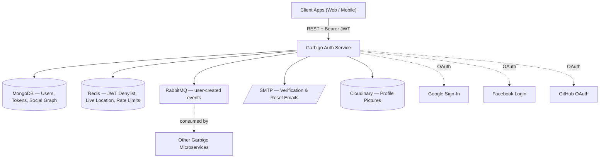
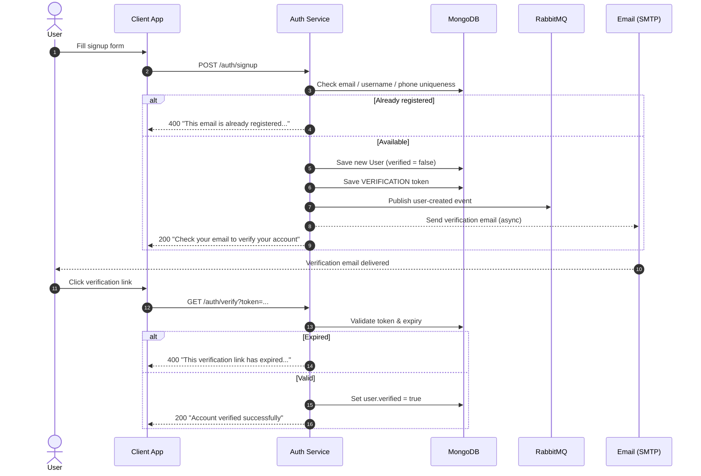
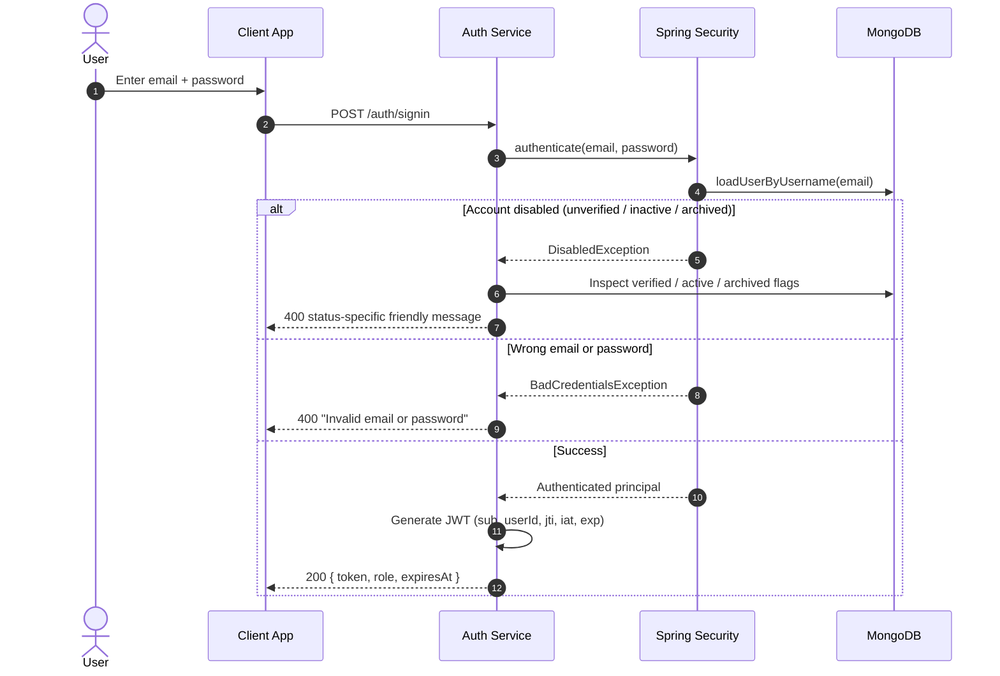
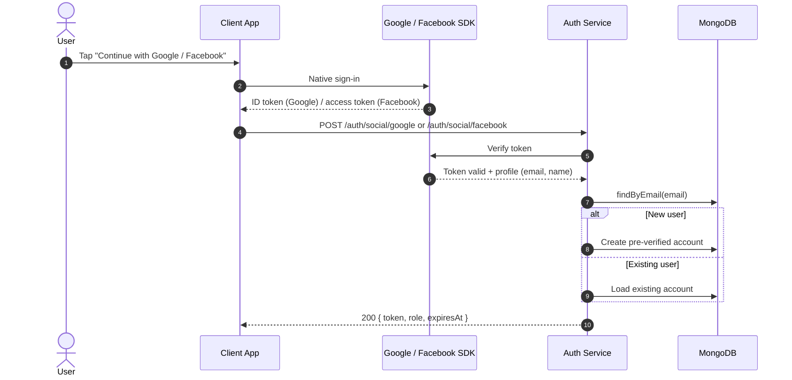
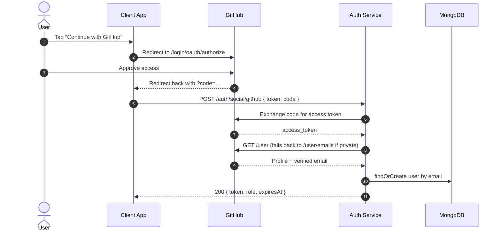
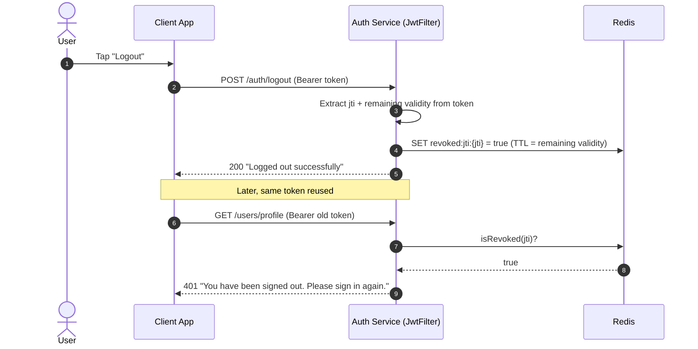
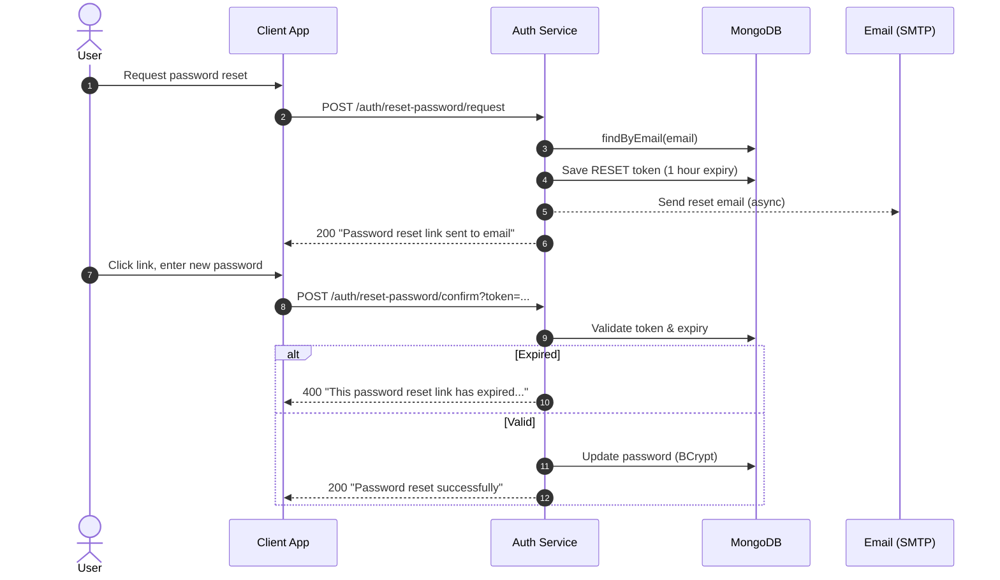

<div align="center">


### Connecting Clients and Waste Collectors Efficiently

<a href="https://readme-typing-svg.demolab.com/">
  
</a>

<br/>

[](#tech-stack)
[](#tech-stack)
[](#security-highlights)
[](#tech-stack)
[](#tech-stack)
[](#tech-stack)
[](#security-highlights)
[](#getting-started)
[](#license)

<br/>

[](#tech-stack)
[](#tech-stack)
[](#tech-stack)
[](#tech-stack)
[](#tech-stack)
[](#api-reference)

<br/>

[](https://github.com/peacemakerbill/garbigo_auth-service/stargazers)
[](https://github.com/peacemakerbill/garbigo_auth-service/network/members)
[](https://github.com/peacemakerbill/garbigo_auth-service/issues)
[](https://github.com/peacemakerbill/garbigo_auth-service/commits/main)
[](https://github.com/peacemakerbill/garbigo_auth-service)

</div>

<br/>

## Menu

- [Overview](#overview)
- [Features](#features)
- [Tech Stack](#tech-stack)
- [Architecture](#architecture)
- [Sequence Diagrams](#sequence-diagrams)
  - [Sign Up and Email Verification](#sign-up-and-email-verification)
  - [Sign In](#sign-in)
  - [Social Login Google and Facebook](#social-login-google-and-facebook)
  - [Social Login GitHub](#social-login-github)
  - [Logout and Token Revocation](#logout-and-token-revocation)
  - [Forgot Password](#forgot-password)
- [API Reference](#api-reference)
- [Getting Started](#getting-started)
- [Environment Variables](#environment-variables)
- [Project Structure](#project-structure)
- [Security Highlights](#security-highlights)
- [Roadmap](#roadmap)
- [Contributing](#contributing)
- [License](#license)
- [Author](#author)

<br/>

## Overview

**Garbigo Auth Service** is the authentication and identity microservice powering **Garbigo**, a Smart Garbage SaaS platform connecting clients with waste collectors. It owns everything related to *who a user is*: sign up, sign in, social login, email verification, password recovery, profile management, roles, and the social layer (follows, likes, reviews, profile views) that sits on top of a user's identity.

It's built as a standalone Spring Boot service, designed to sit behind an API gateway alongside Garbigo's other microservices, issuing and validating the JWTs that the rest of the platform trusts.

<br/>

## Features

**Authentication**
- Email + password sign up and sign in, with account-status-aware error messages (unverified / inactive / archived all get a distinct, actionable response)
- Social sign-in via Google, Facebook, and GitHub — sign up and sign in are the same request; an unrecognized email creates the account
- Stateless JWT access tokens (`sub`, `userId`, `jti`, `iat`, `exp`) with a Redis-backed revocation denylist, so logout actually invalidates the token instead of just discarding it client-side
- Email verification with resend, and forgot-password / reset-password flows, both backed by short-lived, single-use tokens
- Change password for authenticated users

**Users & Profiles**
- Full profile CRUD: name, username, phone, home address, waste preferences, collection schedule
- Profile picture upload via Cloudinary
- Live location tracking (Redis-backed, low-latency reads/writes)
- Username, email and phone number uniqueness enforced at both the application and database level

**Social Layer**
- Follow / unfollow, like / unlike, star ratings with written reviews
- Profile view tracking — "who viewed me" and "who I viewed"
- Aggregated per-user social stats (followers, following, likes, average rating)

**Platform Concerns**
- Role-based access control (`CLIENT`, `COLLECTOR`, `ADMIN`, `OPERATIONS`, `FINANCE`, `SUPPORT`)
- Admin user management: create, update, archive, activate, verify — with safeguards against locking out the last admin
- Redis + Redisson-backed rate limiting
- Consistent JSON error responses everywhere, with request validation (`@NotBlank`, `@Email`) surfaced as plain-language messages
- Asynchronous email delivery and a `user-created` RabbitMQ event for downstream services to consume

<br/>

## Tech Stack

| Layer | Technology |
|---|---|
| Language / Runtime | Java 21 |
| Framework | Spring Boot 4.1.1 (Spring Security 7.1.1, Spring Data MongoDB, Spring Data Redis) |
| Primary Database | MongoDB |
| Cache / Ephemeral Store | Redis (Lettuce driver) + Redisson (distributed rate limiting) |
| Messaging | RabbitMQ (Spring AMQP) |
| Authentication | JSON Web Tokens (`jjwt` 0.12.x) |
| Social Sign-In | Google Identity Services, Facebook Graph API, GitHub OAuth |
| Media Storage | Cloudinary (profile pictures) |
| Email | Spring Mail (SMTP) + Thymeleaf templates |
| Object Mapping | ModelMapper |
| Build Tool | Maven |
| Validation | Jakarta Bean Validation |

<br/>

## Architecture



<br/>

## Sequence Diagrams

### Sign Up and Email Verification



### Sign In



### Social Login Google and Facebook



### Social Login GitHub



> GitHub is the odd one out: it never hands the client a ready-made token the way Google/Facebook do. The client only ever sees a short-lived, single-use `code` — exchanging it for a real access token has to happen server-side, since that step requires the client secret.

### Logout and Token Revocation



### Forgot Password



<br/>

## API Reference

All endpoints are prefixed with the service's base URL.

 no token needed &nbsp;&nbsp;
 valid Bearer token required &nbsp;&nbsp;
 ADMIN role required

**Auth** — `/auth`

| Method | Endpoint | Access | Description |
|---|---|---|---|
| POST | `/auth/signup` |  | Create an account |
| POST | `/auth/signin` |  | Email + password sign in |
| POST | `/auth/logout` |  | Revoke the current token |
| GET | `/auth/verify?token=` |  | Verify an account via emailed link |
| POST | `/auth/resend-verification` |  | Request a new verification email |
| POST | `/auth/reset-password/request` |  | Start a password reset |
| POST | `/auth/reset-password/confirm?token=` |  | Complete a password reset |
| POST | `/auth/change-password` |  | Change password (authenticated) |
| POST | `/auth/social/google` |  | Sign up / sign in with Google |
| POST | `/auth/social/facebook` |  | Sign up / sign in with Facebook |
| POST | `/auth/social/github` |  | Sign up / sign in with GitHub |

**Users** — `/users`

| Method | Endpoint | Access | Description |
|---|---|---|---|
| GET | `/users/profile` |  | Get the current user's profile |
| PUT | `/users/profile` |  | Update profile fields |
| PUT | `/users/profile/picture` |  | Upload a profile picture |
| POST | `/users/live-location` |  | Push a live location update |
| GET | `/users/live-location/{userId}` |  | Read a user's current location |
| GET | `/users/collectors` |  | Search collectors |
| GET / POST | `/users` |  | List / create users |
| PUT / DELETE | `/users/{id}` |  | Update / delete a user |
| PUT | `/users/{id}/archive`, `/unarchive`, `/activate`, `/deactivate`, `/verify`, `/unverify` |  | Account status controls |

**Social** — `/social`

| Method | Endpoint | Access | Description |
|---|---|---|---|
| GET | `/social/profile/{userId}` |  | Rich profile summary + live location |
| POST / DELETE | `/social/follow/{userId}` |  | Follow / unfollow |
| GET | `/social/followers/{userId}`, `/following/{userId}` |  | Follower / following lists |
| POST / DELETE | `/social/like` |  | Like / unlike |
| POST / PUT / DELETE | `/social/review`, `/review/{id}` |  | Submit, edit, or delete a review |
| GET | `/social/reviews/{targetId}` |  | Reviews for a target |
| GET | `/social/stats/{userId}` |  | Followers, following, likes, average rating |

**Profile Views** — `/profile-views`

| Method | Endpoint | Access | Description |
|---|---|---|---|
| POST | `/profile-views/{viewedUserId}` |  | Record a view (anonymous if unauthenticated) |
| GET | `/profile-views/my-stats` |  | View statistics for the current user |
| GET | `/profile-views/who-viewed-me`, `/who-i-viewed` |  | View history |

A ready-to-import Postman collection is included in the repository for quick exploration of every endpoint above.

<br/>

## Getting Started

### Prerequisites

- Java 21+
- Maven 3.9+
- MongoDB, Redis, and RabbitMQ running locally (or reachable via the URLs you configure)
- A Gmail (or other SMTP) account for outbound email
- OAuth credentials for whichever social providers you want enabled (Google, Facebook, GitHub)
- A Cloudinary account for profile picture storage

### Installation

```bash
git clone https://github.com/peacemakerbill/garbigo_auth-service.git
cd garbigo_auth-service
cp .env.example .env
```

Fill in `.env` with your own values (see [Environment Variables](#environment-variables) below), then run:

```bash
./mvnw spring-boot:run
```

The service starts on `http://localhost:8080` by default. Confirm it's up:

```bash
curl http://localhost:8080/health
```

<br/>

## Environment Variables

Configuration is loaded from `.env` at startup (via `spring.config.import`), falling back to sane local defaults where one exists. Copy `.env.example` to `.env` and fill in real values — `.env` itself is git-ignored.

| Variable | Purpose |
|---|---|
| `MONGODB_URI` | MongoDB connection string |
| `REDIS_HOST`, `REDIS_PORT` | Redis connection |
| `RABBITMQ_HOST`, `RABBITMQ_PORT`, `RABBITMQ_USERNAME`, `RABBITMQ_PASSWORD` | RabbitMQ connection |
| `RABBITMQ_QUEUE_USER_CREATED` | Queue name for the user-created event |
| `MAIL_HOST`, `MAIL_PORT`, `MAIL_USERNAME`, `MAIL_PASSWORD` | Outbound SMTP for verification/reset emails |
| `CLOUDINARY_CLOUD_NAME`, `CLOUDINARY_API_KEY`, `CLOUDINARY_API_SECRET` | Profile picture storage |
| `JWT_SECRET`, `JWT_EXPIRATION` | Token signing key and lifetime (seconds) |
| `RATE_LIMIT_REQUESTS_PER_MINUTE` | Per-client request cap |
| `SERVER_PORT` | HTTP port |
| `APP_URL` | Base URL used to build links in emails |
| `GOOGLE_CLIENT_ID` | Google Sign-In |
| `FACEBOOK_APP_ID`, `FACEBOOK_APP_SECRET` | Facebook Login |
| `GITHUB_CLIENT_ID`, `GITHUB_CLIENT_SECRET` | GitHub OAuth |

<br/>

## Project Structure

```
src/main/java/com/garbigo/auth
├── config          # Security, Mongo, Redis, RabbitMQ, Mail, Cloudinary, ModelMapper, rate limiting
├── controller       # REST controllers: Auth, User, Social, ProfileView, Home
├── dto              # Request/response payloads
├── exception        # CustomException + global JSON error handling
├── model            # MongoDB documents: User, Token, Follow, Like, Review, ProfileView, LiveLocation
├── repository       # Spring Data MongoDB repositories
├── security         # JwtUtil, JwtFilter, TokenBlacklistService, UserDetailsServiceImpl
├── service          # Business logic: AuthService, SocialAuthService, UserService, SocialService, ...
└── util             # RateLimiter

src/main/resources
├── application.yml
└── templates        # Thymeleaf email templates (verification, password reset)
```

<br/>

## Security Highlights

- **Stateless JWTs, but genuinely revocable.** Logging out writes the token's `jti` into a Redis denylist with a TTL equal to its remaining validity — no cleanup job needed, and a revoked token is rejected before signature/expiry checks even run.
- **Account status is checked before anything else.** Unverified, deactivated, and archived accounts each get a distinct, specific message on sign-in — deliberately more informative than a generic failure, since a legitimate owner needs to know what to do next.
- **Enumeration-conscious where it matters.** Wrong password and unknown email return the identical generic message; Spring Security's own `DaoAuthenticationProvider` behavior is relied on rather than re-implemented.
- **No plaintext secrets in source control.** Configuration is environment-variable driven end to end.
- **Consistent, human-readable error responses.** Every failure path — validation, business rule, or unexpected exception — returns clean JSON, never a raw stack trace or a leaked internal exception message.
- **Passwords are BCrypt-hashed**, and social-login accounts never receive a local password at all.

<br/>

## Roadmap

- [ ] "Log out everywhere" (revoke every token for a user, not just the one used to log out)
- [ ] Two-factor authentication
- [ ] Refresh token support
- [ ] OpenAPI / Swagger documentation
- [ ] Automated test suite (unit + integration)

<br/>

## Contributing

Contributions are welcome.

1. Fork the repository
2. Create a feature branch (`git checkout -b feature/something-great`)
3. Commit your changes (`git commit -m "Add something great"`)
4. Push to your branch (`git push origin feature/something-great`)
5. Open a Pull Request

<br/>

## License

This project is suggested to be licensed under the MIT License — add a `LICENSE` file to the repository root to make that official, or swap in whichever license you prefer.

<br/>

## Author

<div align="center">


**Bill Graham Peacemaker**

[](https://github.com/peacemakerbill)
[](https://github.com/peacemakerbill/garbigo_auth-service)

</div>

<br/>

