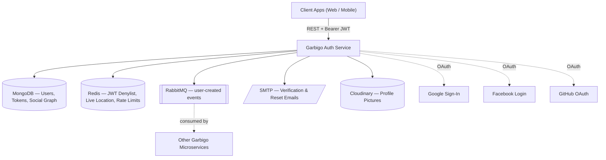
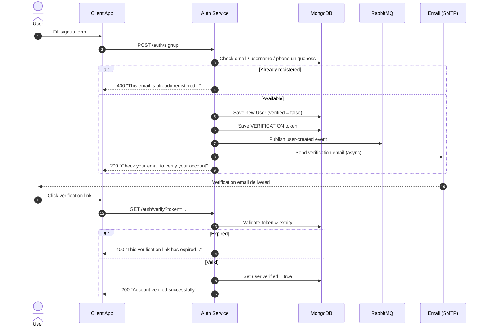
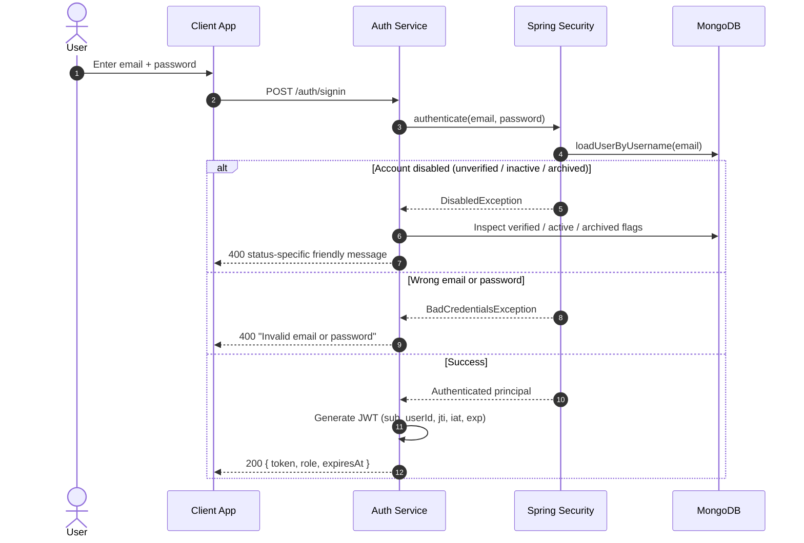
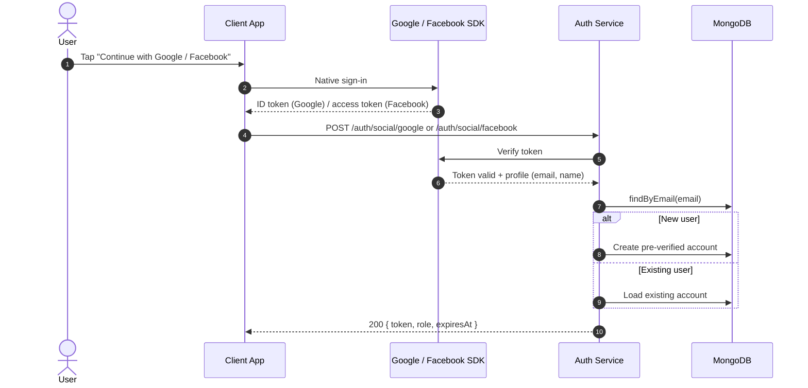
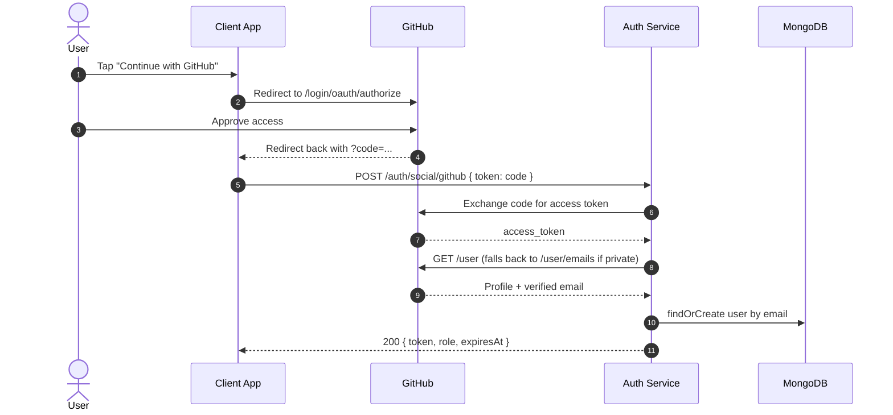
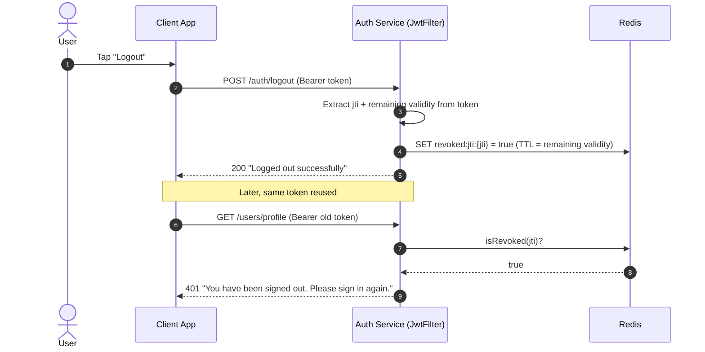
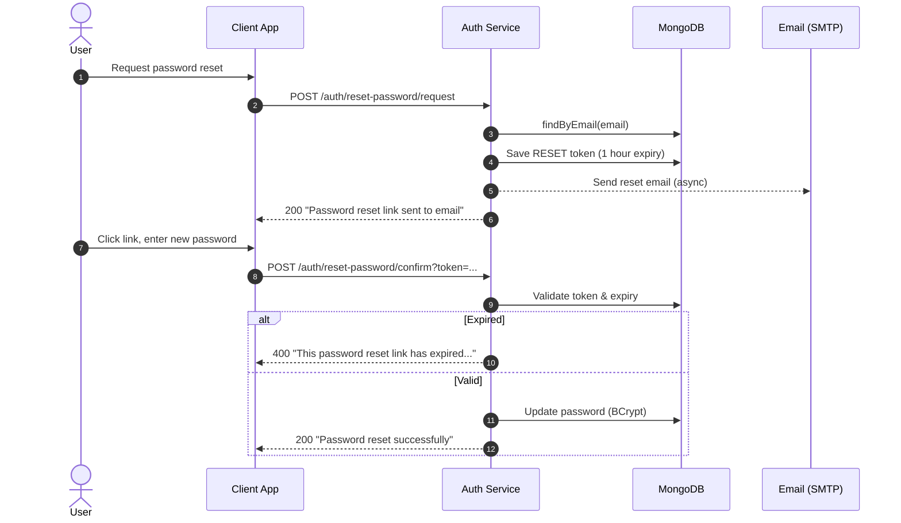

<div align="center">


<a href="https://readme-typing-svg.demolab.com/">
  
</a>

<a href="https://readme-typing-svg.demolab.com/">
  
</a>

<br/>

[](#tech-stack)
[](#tech-stack)
[](#security-highlights)
[](#tech-stack)
[](#tech-stack)
[](#tech-stack)
[](#security-highlights)
[](#getting-started)
[](#license)

<br/>

[](#tech-stack)
[](#tech-stack)
[](#tech-stack)
[](#tech-stack)
[](#tech-stack)
[](#api-reference)

<br/>

[](https://github.com/peacemakerbill/garbigo_auth-service/stargazers)
[](https://github.com/peacemakerbill/garbigo_auth-service/network/members)
[](https://github.com/peacemakerbill/garbigo_auth-service/issues)
[](https://github.com/peacemakerbill/garbigo_auth-service/commits/main)
[](https://github.com/peacemakerbill/garbigo_auth-service)

</div>

<br/>

## Menu

- [Overview](#overview)
- [Features](#features)
- [Tech Stack](#tech-stack)
- [Architecture](#architecture)
- [Sequence Diagrams](#sequence-diagrams)
  - [Sign Up and Email Verification](#sign-up-and-email-verification)
  - [Sign In](#sign-in)
  - [Social Login Google and Facebook](#social-login-google-and-facebook)
  - [Social Login GitHub](#social-login-github)
  - [Logout and Token Revocation](#logout-and-token-revocation)
  - [Forgot Password](#forgot-password)
- [API Reference](#api-reference)
- [Getting Started](#getting-started)
- [Environment Variables](#environment-variables)
- [Social Login Setup](#social-login-setup)
  - [The Test Console](#the-test-console)
  - [Google Setup and Testing](#google-setup-and-testing)
  - [Facebook Setup and Testing](#facebook-setup-and-testing)
  - [GitHub Setup and Testing](#github-setup-and-testing)
  - [Verifying a Social Login](#verifying-a-social-login)
- [Project Structure](#project-structure)
- [Security Highlights](#security-highlights)
- [Roadmap](#roadmap)
- [Contributing](#contributing)
- [License](#license)
- [Author](#author)

<br/>

## Overview

**Garbigo Auth Service** is the authentication and identity microservice powering **Garbigo**, a Smart Garbage SaaS platform connecting clients with waste collectors. It owns everything related to *who a user is*: sign up, sign in, social login, email verification, password recovery, profile management, roles, and the social layer (follows, likes, reviews, profile views) that sits on top of a user's identity.

It's built as a standalone Spring Boot service, designed to sit behind an API gateway alongside Garbigo's other microservices, issuing and validating the JWTs that the rest of the platform trusts.

<br/>

## Features

**Authentication**
- Email + password sign up and sign in, with account-status-aware error messages (unverified / inactive / archived all get a distinct, actionable response)
- Social sign-in via Google, Facebook, and GitHub — sign up and sign in are the same request; an unrecognized email creates the account
- Stateless JWT access tokens (`sub`, `userId`, `jti`, `iat`, `exp`) with a Redis-backed revocation denylist, so logout actually invalidates the token instead of just discarding it client-side
- Email verification with resend, and forgot-password / reset-password flows, both backed by short-lived, single-use tokens
- Change password for authenticated users

**Users & Profiles**
- Full profile CRUD: name, username, phone, home address, waste preferences, collection schedule
- Profile picture upload via Cloudinary
- Live location tracking (Redis-backed, low-latency reads/writes)
- Username, email and phone number uniqueness enforced at both the application and database level

**Social Layer**
- Follow / unfollow, like / unlike, star ratings with written reviews
- Profile view tracking — "who viewed me" and "who I viewed"
- Aggregated per-user social stats (followers, following, likes, average rating)

**Platform Concerns**
- Role-based access control (`CLIENT`, `COLLECTOR`, `ADMIN`, `OPERATIONS`, `FINANCE`, `SUPPORT`)
- Admin user management: create, update, archive, activate, verify — with safeguards against locking out the last admin
- Redis + Redisson-backed rate limiting
- Consistent JSON error responses everywhere, with request validation (`@NotBlank`, `@Email`) surfaced as plain-language messages
- Asynchronous email delivery and a `user-created` RabbitMQ event for downstream services to consume

<br/>

## Tech Stack

| Layer | Technology |
|---|---|
| Language / Runtime | Java 21 |
| Framework | Spring Boot 4.1.1 (Spring Security 7.1.1, Spring Data MongoDB, Spring Data Redis) |
| Primary Database | MongoDB |
| Cache / Ephemeral Store | Redis (Lettuce driver) + Redisson (distributed rate limiting) |
| Messaging | RabbitMQ (Spring AMQP) |
| Authentication | JSON Web Tokens (`jjwt` 0.12.x) |
| Social Sign-In | Google Identity Services, Facebook Graph API, GitHub OAuth |
| Media Storage | Cloudinary (profile pictures) |
| Email | Spring Mail (SMTP) + Thymeleaf templates |
| Object Mapping | ModelMapper |
| Build Tool | Maven |
| Validation | Jakarta Bean Validation |

<br/>

## Architecture


```mermaid
flowchart TD
    Client["Client Apps (Web / Mobile)"] -->|"REST + Bearer JWT"| Auth[Garbigo Auth Service]

    Auth --> Mongo[("MongoDB — Users, Tokens, Social Graph")]
    Auth --> Redis[("Redis — JWT Denylist, Live Location, Rate Limits")]
    Auth --> Rabbit[["RabbitMQ — user-created events"]]
    Auth --> SMTP[/"SMTP — Verification & Reset Emails"/]
    Auth --> Cloudinary[("Cloudinary — Profile Pictures")]

    Auth -.OAuth.-> Google["Google Sign-In"]
    Auth -.OAuth.-> Facebook["Facebook Login"]
    Auth -.OAuth.-> GitHub["GitHub OAuth"]

    Rabbit -.consumed by.-> Downstream["Other Garbigo Microservices"]
```

<br/>

## Sequence Diagrams

### Sign Up and Email Verification


```mermaid
sequenceDiagram
    autonumber
    actor U as User
    participant C as Client App
    participant A as Auth Service
    participant M as MongoDB
    participant Q as RabbitMQ
    participant E as Email (SMTP)

    U->>C: Fill signup form
    C->>A: POST /auth/signup
    A->>M: Check email / username / phone uniqueness
    alt Already registered
        A-->>C: 400 "This email is already registered..."
    else Available
        A->>M: Save new User (verified = false)
        A->>M: Save VERIFICATION token
        A->>Q: Publish user-created event
        A-->>E: Send verification email (async)
        A-->>C: 200 "Check your email to verify your account"
    end
    E-->>U: Verification email delivered
    U->>C: Click verification link
    C->>A: GET /auth/verify?token=...
    A->>M: Validate token & expiry
    alt Expired
        A-->>C: 400 "This verification link has expired..."
    else Valid
        A->>M: Set user.verified = true
        A-->>C: 200 "Account verified successfully"
    end
```

### Sign In


```mermaid
sequenceDiagram
    autonumber
    actor U as User
    participant C as Client App
    participant A as Auth Service
    participant S as Spring Security
    participant M as MongoDB

    U->>C: Enter email + password
    C->>A: POST /auth/signin
    A->>S: authenticate(email, password)
    S->>M: loadUserByUsername(email)
    alt Account disabled (unverified / inactive / archived)
        S-->>A: DisabledException
        A->>M: Inspect verified / active / archived flags
        A-->>C: 400 status-specific friendly message
    else Wrong email or password
        S-->>A: BadCredentialsException
        A-->>C: 400 "Invalid email or password"
    else Success
        S-->>A: Authenticated principal
        A->>A: Generate JWT (sub, userId, jti, iat, exp)
        A-->>C: 200 { token, role, expiresAt }
    end
```

### Social Login Google and Facebook


```mermaid
sequenceDiagram
    autonumber
    actor U as User
    participant C as Client App
    participant P as Google / Facebook SDK
    participant A as Auth Service
    participant M as MongoDB

    U->>C: Tap "Continue with Google / Facebook"
    C->>P: Native sign-in
    P-->>C: ID token (Google) / access token (Facebook)
    C->>A: POST /auth/social/google or /auth/social/facebook
    A->>P: Verify token
    P-->>A: Token valid + profile (email, name)
    A->>M: findByEmail(email)
    alt New user
        A->>M: Create pre-verified account
    else Existing user
        A->>M: Load existing account
    end
    A-->>C: 200 { token, role, expiresAt }
```

### Social Login GitHub


```mermaid
sequenceDiagram
    autonumber
    actor U as User
    participant C as Client App
    participant G as GitHub
    participant A as Auth Service
    participant M as MongoDB

    U->>C: Tap "Continue with GitHub"
    C->>G: Redirect to /login/oauth/authorize
    U->>G: Approve access
    G-->>C: Redirect back with ?code=...
    C->>A: POST /auth/social/github { token: code }
    A->>G: Exchange code for access token
    G-->>A: access_token
    A->>G: GET /user (falls back to /user/emails if private)
    G-->>A: Profile + verified email
    A->>M: findOrCreate user by email
    A-->>C: 200 { token, role, expiresAt }
```

> GitHub is the odd one out: it never hands the client a ready-made token the way Google/Facebook do. The client only ever sees a short-lived, single-use `code` — exchanging it for a real access token has to happen server-side, since that step requires the client secret.

### Logout and Token Revocation


```mermaid
sequenceDiagram
    autonumber
    actor U as User
    participant C as Client App
    participant A as Auth Service (JwtFilter)
    participant R as Redis

    U->>C: Tap "Logout"
    C->>A: POST /auth/logout (Bearer token)
    A->>A: Extract jti + remaining validity from token
    A->>R: SET revoked:jti:{jti} = true (TTL = remaining validity)
    A-->>C: 200 "Logged out successfully"

    Note over C,A: Later, same token reused
    C->>A: GET /users/profile (Bearer old token)
    A->>R: isRevoked(jti)?
    R-->>A: true
    A-->>C: 401 "You have been signed out. Please sign in again."
```

### Forgot Password


```mermaid
sequenceDiagram
    autonumber
    actor U as User
    participant C as Client App
    participant A as Auth Service
    participant M as MongoDB
    participant E as Email (SMTP)

    U->>C: Request password reset
    C->>A: POST /auth/reset-password/request
    A->>M: findByEmail(email)
    A->>M: Save RESET token (1 hour expiry)
    A-->>E: Send reset email (async)
    A-->>C: 200 "Password reset link sent to email"
    U->>C: Click link, enter new password
    C->>A: POST /auth/reset-password/confirm?token=...
    A->>M: Validate token & expiry
    alt Expired
        A-->>C: 400 "This password reset link has expired..."
    else Valid
        A->>M: Update password (BCrypt)
        A-->>C: 200 "Password reset successfully"
    end
```

<br/>

## API Reference

All endpoints are prefixed with the service's base URL.

 no token needed &nbsp;&nbsp;
 valid Bearer token required &nbsp;&nbsp;
 ADMIN role required &nbsp;&nbsp;
 X-Internal-Api-Key header required, no user token

**Auth** — `/auth`

| Method | Endpoint | Access | Description |
|---|---|---|---|
| POST | `/auth/signup` |  | Create an account |
| POST | `/auth/signin` |  | Email + password sign in |
| POST | `/auth/logout` |  | Revoke the current token |
| GET | `/auth/verify?token=` |  | Verify an account via emailed link |
| POST | `/auth/resend-verification` |  | Request a new verification email |
| POST | `/auth/reset-password/request` |  | Start a password reset |
| POST | `/auth/reset-password/confirm?token=` |  | Complete a password reset |
| POST | `/auth/change-password` |  | Change password (authenticated) |
| POST | `/auth/social/google` |  | Sign up / sign in with Google |
| POST | `/auth/social/facebook` |  | Sign up / sign in with Facebook |
| POST | `/auth/social/github` |  | Sign up / sign in with GitHub |

**Users** — `/users`

| Method | Endpoint | Access | Description |
|---|---|---|---|
| GET | `/users/profile` |  | Get the current user's profile |
| PUT | `/users/profile` |  | Update profile fields |
| PUT | `/users/profile/picture` |  | Upload a profile picture |
| POST | `/users/live-location` |  | Push a live location update |
| GET | `/users/live-location/{userId}` |  | Read a user's current location |
| GET | `/users/collectors` |  | Search collectors |
| GET / POST | `/users` |  | List / create users |
| PUT / DELETE | `/users/{id}` |  | Update / delete a user |
| PUT | `/users/{id}/archive`, `/unarchive`, `/activate`, `/deactivate`, `/verify`, `/unverify` |  | Account status controls |

**Social** — `/social`

| Method | Endpoint | Access | Description |
|---|---|---|---|
| GET | `/social/profile/{userId}` |  | Rich profile summary + live location |
| POST / DELETE | `/social/follow/{userId}` |  | Follow / unfollow |
| GET | `/social/followers/{userId}`, `/following/{userId}` |  | Follower / following lists |
| POST / DELETE | `/social/like` |  | Like / unlike |
| POST / PUT / DELETE | `/social/review`, `/review/{id}` |  | Submit, edit, or delete a review |
| GET | `/social/reviews/{targetId}` |  | Reviews for a target |
| GET | `/social/stats/{userId}` |  | Followers, following, likes, average rating |

**Profile Views** — `/profile-views`

| Method | Endpoint | Access | Description |
|---|---|---|---|
| POST | `/profile-views/{viewedUserId}` |  | Record a view (anonymous if unauthenticated) |
| GET | `/profile-views/my-stats` |  | View statistics for the current user |
| GET | `/profile-views/who-viewed-me`, `/who-i-viewed` |  | View history |

**Internal** — `/internal` (service-to-service only)

| Method | Endpoint | Access | Description |
|---|---|---|---|
| GET | `/internal/users` |  | Full user data (everything except the password hash) for other microservices building a local read model |

`Internal` endpoints authenticate exclusively via an `X-Internal-Api-Key` header matching the shared `INTERNAL_API_KEY` secret — not a user's JWT, and not gated by any business role, even `ADMIN`. See [Security Highlights](#security-highlights).

A ready-to-import Postman collection is included in the repository for quick exploration of every endpoint above.

<br/>

## Getting Started

### Prerequisites

- Java 21+
- Maven 3.9+
- MongoDB, Redis, and RabbitMQ running locally (or reachable via the URLs you configure)
- A Gmail (or other SMTP) account for outbound email
- OAuth credentials for whichever social providers you want enabled (Google, Facebook, GitHub)
- A Cloudinary account for profile picture storage

### Installation

```bash
git clone https://github.com/peacemakerbill/garbigo_auth-service.git
cd garbigo_auth-service
cp .env.example .env
```

Fill in `.env` with your own values (see [Environment Variables](#environment-variables) below), then run:

```bash
./mvnw spring-boot:run
```

The service starts on `http://localhost:8080` by default. Confirm it's up:

```bash
curl http://localhost:8080/health
```

<br/>

## Environment Variables

Configuration is loaded from `.env` at startup (via `spring.config.import`), falling back to sane local defaults where one exists. Copy `.env.example` to `.env` and fill in real values — `.env` itself is git-ignored.

| Variable | Purpose |
|---|---|
| `MONGODB_URI` | MongoDB connection string |
| `REDIS_HOST`, `REDIS_PORT` | Redis connection |
| `RABBITMQ_HOST`, `RABBITMQ_PORT`, `RABBITMQ_USERNAME`, `RABBITMQ_PASSWORD` | RabbitMQ connection |
| `RABBITMQ_QUEUE_USER_CREATED` | Queue name for the user-created event |
| `MAIL_HOST`, `MAIL_PORT`, `MAIL_USERNAME`, `MAIL_PASSWORD` | Outbound SMTP for verification/reset emails |
| `CLOUDINARY_CLOUD_NAME`, `CLOUDINARY_API_KEY`, `CLOUDINARY_API_SECRET` | Profile picture storage |
| `JWT_SECRET`, `JWT_EXPIRATION` | Token signing key and lifetime (seconds) |
| `RATE_LIMIT_REQUESTS_PER_MINUTE` | Per-client request cap |
| `SERVER_PORT` | HTTP port |
| `APP_URL` | Base URL used to build links in emails |
| `GOOGLE_CLIENT_ID` | Google Sign-In (ID token verification, no client secret needed) |
| `FACEBOOK_APP_ID`, `FACEBOOK_APP_SECRET` | Facebook Login |
| `GITHUB_CLIENT_ID`, `GITHUB_CLIENT_SECRET` | GitHub OAuth |
| `INTERNAL_API_KEY` | Shared secret other microservices send in the `X-Internal-Api-Key` header |

<br/>

## Social Login Setup

Google, Facebook, and GitHub all follow the same pattern. Sign up and sign in are a single request: the client obtains a credential from the provider and posts it to this service, which verifies it with the provider and returns its own JWT. There is no separate registration step and no password involved.

| Provider | Endpoint | What the client sends as `token` | Backend `.env` values |
|---|---|---|---|
| Google | `POST /auth/social/google` | Google ID token (a JWT from Google Identity Services) | `GOOGLE_CLIENT_ID` only. No client secret is needed, because ID tokens are verified against Google's public keys. |
| Facebook | `POST /auth/social/facebook` | Facebook user access token with the `email` permission | `FACEBOOK_APP_ID`, `FACEBOOK_APP_SECRET` |
| GitHub | `POST /auth/social/github` | One-time OAuth `code` | `GITHUB_CLIENT_ID`, `GITHUB_CLIENT_SECRET` |

All three endpoints are public (no `Authorization` header needed). Request body, the same for all three:

```json
{ "token": "<credential from the provider>" }
```

Successful response:

```json
{
    "token": "<this service's JWT>",
    "role": "CLIENT",
    "expiresAt": "2026-11-04T22:27:38.539070694Z"
}
```

The returned JWT is the same kind of token that `POST /auth/login` returns, so it works with every protected endpoint and with `POST /auth/logout`.

How accounts are matched:

- An email with no account yet creates a new `CLIENT` account, marked verified, with no password. The provider's display name is split so the first word becomes `firstName` and the last word becomes `lastName`. A single-word name fills `firstName` only.
- An email that already has an account signs in to that account, whether it was created by password or by another provider. If that account was unverified, it becomes verified.
- Facebook and GitHub accounts must expose an email address. Without one, the request fails with a message asking the person to add one, and no account is created.
- The email is the identity. Signing in with Google and later with GitHub using the same email reaches the same account.

Common error responses, the same shape as the rest of the API:

```json
{ "message": "We couldn't sign you in with GitHub. Please try again." }
```

When a login fails, the real reason is printed in the service console under a tag such as `GOOGLE LOGIN`, `FACEBOOK LOGIN`, or `GITHUB LOGIN`. Clients only ever see the friendly message.

### The Test Console

`google-test/social-login-test.html` is a single page that exercises all three providers. It needs no build step and no dependencies, and it never sees a client secret.

What it does:

- Runs the Google, Facebook, or GitHub login and shows each step as it happens: approve, provider token, Garbigo checks it, Garbigo JWT.
- **Sign in with Garbigo** mode posts the provider token to the matching `/auth/social/...` endpoint and shows the JWT, its role and expiry, and a button for `GET /users/profile` and `POST /auth/logout`.
- **Get the token only** mode keeps the provider token on the page, with a copy button for the token, the request body, and the URL, so it can be sent from Postman.
- Logs every request and response, with errors shown exactly as the service returns them.

Run it:

1. Start the auth service.
2. Serve only the test folder:
   ```bash
   cd google-test
   python3 -m http.server 3000 --bind 127.0.0.1
   ```
   Never start this server from the project root, because a static file server would expose `.env`.
3. Open `http://localhost:3000/social-login-test.html`. Do not open the file directly, because every provider rejects `file://` origins.
4. Open **Configuration** in the sidebar and enter the backend URL (`http://localhost:8080`), the Google client ID, the Facebook app ID, and the GitHub client ID. These are public identifiers. Never enter a client secret or app secret. Click **Save and reload**.
5. For GitHub, copy the callback URL shown in Configuration into your GitHub OAuth App as the **Authorization callback URL**. It is `http://localhost:3000/social-login-test.html`.

Provider notes:

- **Google** works as soon as the client ID and authorized origins are set up (see the Google section below).
- **GitHub** redirects to GitHub and returns to the same page, which reads the code itself. There is nothing to copy by hand.
- **Facebook** only allows its login popup from https pages. Over `http://localhost`, create a token in the Graph API Explorer and paste it into the Facebook card on the page.

### Google Setup and Testing

**Google Cloud Console**

1. Open APIs and Services, then Credentials, and create an OAuth client with application type **Web application**. Other types (Android, iOS, Desktop) have no JavaScript origins and fail with `invalid_client`.
2. Under **Authorized JavaScript origins**, add `http://localhost:3000` and `http://localhost`. Enter them exactly, with no trailing slash and no path. Leave **Authorized redirect URIs** empty. Changes can take a few minutes to apply.
3. On the OAuth consent screen, fill in the app name, support email, and developer contact email. While the publishing status is **Testing**, add each Google account you will sign in with under **Test users**.
4. Copy the **Client ID** (it ends in `.apps.googleusercontent.com`) into `GOOGLE_CLIENT_ID` in `.env`, then restart the service.

**Testing with the test console**

The Test Console gets a real Google ID token, decodes its claims, and posts it to this service.

1. Set up the Test Console as described above, with your Google client ID saved in Configuration.
2. Click **Continue with Google** and sign in. In token only mode the ID token is shown on the page.
3. In sign in mode the page posts it to `/auth/social/google` and shows the JWT.
4. The first call creates the account. Calling again, with the same token (valid for about an hour) or a fresh one, signs in to the same account without creating a duplicate.

To test from Postman instead, switch the console to **Get the token only**, click the Google button, and copy the request body it shows.

**Troubleshooting**

| What you see | Cause |
|---|---|
| Popup shows `invalid_request` with `origin=file://` | The page was opened as a local file. Serve it over `http://localhost:3000` as above. |
| Popup shows `invalid_client` with "no registered origin" | The OAuth client has no Authorized JavaScript origins, or it is not a Web application client. |
| Popup shows a plain `400` saying the request is malformed | The value entered is not a Google client ID. It should end in `.apps.googleusercontent.com`. |
| Popup shows `access_denied` | The consent screen is in Testing and your account is not listed under Test users. |
| `400` "We couldn't verify your Google account" | The ID token failed verification: it expired, was issued for a different client ID than `GOOGLE_CLIENT_ID`, or is an access token instead of an ID token. The service console prints the reason. |

### Facebook Setup and Testing

**Meta for Developers**

1. Create an app, or use your existing one. When asked for a use case, choose **Authenticate and request data from users with Facebook Login**.
2. From App settings, then Basic, copy the **App ID** and **App Secret** into `FACEBOOK_APP_ID` and `FACEBOOK_APP_SECRET` in `.env`, then restart the service.
3. Add the email permission. Open Use cases, click **Customize** on the Facebook Login use case, then under **Permissions and features** add `email`. Meta does not add it for you, and without it every token carries only `public_profile`, which contains no email address.
4. While the app is in **Development** mode, only accounts with a role on the app (administrator, developer, or tester) can log in. Add your test account under App roles. Going live for the public requires Meta app review for the `email` permission.

**Testing with the Graph API Explorer**

The Facebook JavaScript SDK only allows its login popup from `https` pages, so the Test Console's Facebook button does not work over `http://localhost`. The Graph API Explorer is the quickest way to get a real token. You can paste that token into the Facebook card on the Test Console, or send it from Postman.

1. Open the Graph API Explorer at `developers.facebook.com/tools/explorer` and pick your app under **Meta App**. It must be the same app as `FACEBOOK_APP_ID`: the service checks the `app_id` Facebook reports for the token and rejects tokens issued to any other app.
2. Under **Permissions**, add `email` and `public_profile`, then click **Generate Access Token** and approve the dialog.
3. Before using the token, confirm it with the Access Token Debugger at `developers.facebook.com/tools/debug/accesstoken`. Check that:
   - **App ID** equals your `FACEBOOK_APP_ID`.
   - **Scopes** lists `email` as well as `public_profile`.
   - **Expires** is in the future. User tokens last about an hour.
4. Confirm Facebook actually returns an email by running this in the Explorer:
   ```
   me?fields=id,name,email
   ```
   If the response has no `email`, the account has no email on Facebook, or the permission was not granted. Fix that first, because the service will reject the token for the same reason.
5. Send the token:
   ```
   POST {{base_url}}/auth/social/facebook
   { "token": "<user access token>" }
   ```
6. The first call creates the account. Calling again with the same Facebook account signs in to it. After adding a permission, always generate a new token, because old tokens keep the permissions they were issued with.

**Troubleshooting**

| What you see | Cause |
|---|---|
| `400` "We couldn't verify your Facebook account" | The token is invalid or expired, or was issued to a different app than `FACEBOOK_APP_ID`. In the second case the service console prints `FACEBOOK LOGIN: token was issued for a different app`. |
| `400` "Your Facebook account didn't share an email address" | The `email` permission is missing from the app's use case or from the token (Scopes shows only `public_profile`), or the Facebook account has no email. Add the permission, generate a new token, and try again. |
| Facebook blocks the login dialog | The app is in Development mode and the account has no role on it. |
| Explorer shows a different app than expected | The **Meta App** dropdown is set to another app. Switch it and generate a new token. |

### GitHub Setup and Testing

GitHub never hands the client a ready-made token. It gives a short-lived `code`, and exchanging that for an access token requires the client secret, so the exchange happens inside this service. The client secret never leaves the backend.

**GitHub OAuth App**

1. Open Settings, then Developer settings, then OAuth Apps, and create a new OAuth App.
2. Set **Authorization callback URL** to any URL you control. For local testing `http://localhost:3000/callback` or even `http://localhost:8080/login/oauth2/code/github` both work. The page does not need to exist, because all you need from it is the `code` in the address bar. A real client app would use its own callback URL and send the code to this service.
3. Copy the **Client ID** into `GITHUB_CLIENT_ID`, generate a **Client secret** and copy it into `GITHUB_CLIENT_SECRET`, then restart the service.

**Testing in the browser and Postman**

The quickest way is the Test Console: set the GitHub callback URL to `http://localhost:3000/social-login-test.html`, click **Continue with GitHub**, and the page handles the code. The manual steps below work with any callback URL.

1. Open this in a browser, with your own client ID:
   ```
   https://github.com/login/oauth/authorize?client_id=YOUR_GITHUB_CLIENT_ID&scope=user:email
   ```
2. Approve. The browser lands on your callback URL with the code in the address bar, for example:
   ```
   http://localhost:8080/login/oauth2/code/github?code=a1b2c3d4e5f6a7b8c9d0&iss=https%3A%2F%2Fgithub.com%2Flogin%2Foauth
   ```
   The page itself may show a 403 or 404. That is expected and harmless. Copy only the value between `code=` and `&iss=`. If there is no `&iss=`, copy everything after `code=`.
3. Within 10 minutes, send it:
   ```
   POST {{base_url}}/auth/social/github
   { "token": "<the code>" }
   ```

Each code works once. For a second login, repeat these steps to get a fresh code. Keep `scope=user:email` in the URL, which lets accounts with a private email address sign in: the service falls back to GitHub's `/user/emails` list and picks the primary verified address.

**Troubleshooting**

| What you see | Cause |
|---|---|
| `400` "We couldn't sign you in with GitHub" | The code exchange failed. The service console prints `GITHUB LOGIN: code exchange failed:` followed by GitHub's own error, such as `bad_verification_code` (code reused or expired) or `incorrect_client_credentials` (wrong client ID or secret). |
| `400` "Your GitHub account needs a verified email address" | The account has no verified email, or `user:email` was missing from the authorize URL. |
| Callback page shows 403 or 404 | Expected. Nothing handles that path. Copy the code from the address bar. |
| Code copied with extra text such as `&iss=...` | Only the value after `code=` and before the next `&` is the code. |

### Verifying a Social Login

After any successful social login, check the result the same way for all three providers.

1. Call a protected endpoint with the returned token:
   ```
   GET {{base_url}}/users/profile
   Authorization: Bearer <token>
   ```
   The profile should show the provider's name, the email, `verified: true`, and role `CLIENT`.
2. Check the stored document in MongoDB:
   ```js
   db.users.findOne({ email: "you@example.com" }, { password: 1, verified: 1, role: 1, firstName: 1, lastName: 1 })
   ```
   Social-only accounts have no `password` field, `verified` is `true`, and `role` is `CLIENT`.
3. Repeat the login and confirm that no second document appears for the same email:
   ```js
   db.users.countDocuments({ email: "you@example.com" })
   ```
   The count must stay at `1`.

**Test checklist for each provider**

| Case | Expected result |
|---|---|
| First login with a new email | `200`, account created, token returned |
| Second login with the same account | `200`, same account, no duplicate |
| Login with an email that already registered by password | `200`, signs in to the existing account and marks it verified |
| Garbage token such as `abc` | `400` with a friendly "We couldn't verify your account" or "We couldn't sign you in" message, no stack trace in the response |
| Expired or reused credential | `400` with the same friendly message |
| Provider account with no email (Facebook and GitHub) | `400` asking the person to add an email, no account created |
| Returned token on `POST /auth/logout` | Token is revoked and can no longer be used |

A social-only account has no password. To let that person also sign in with email and password, they use the forgot password flow, which sets one.

<br/>

## Project Structure

```
src/main/java/com/garbigo/auth
├── config          # Security, Mongo, Redis, RabbitMQ, Mail, Cloudinary, ModelMapper, rate limiting
├── controller       # REST controllers: Auth, User, Social, ProfileView, Home
├── dto              # Request/response payloads
├── exception        # CustomException + global JSON error handling
├── model            # MongoDB documents: User, Token, Follow, Like, Review, ProfileView, LiveLocation
├── repository       # Spring Data MongoDB repositories
├── security         # JwtUtil, JwtFilter, TokenBlacklistService, UserDetailsServiceImpl
├── service          # Business logic: AuthService, SocialAuthService, UserService, SocialService, ...
└── util             # RateLimiter

src/main/resources
├── application.yml
└── templates        # Thymeleaf email templates (verification, password reset)
```

<br/>

## Security Highlights

- **Stateless JWTs, but genuinely revocable.** Logging out writes the token's `jti` into a Redis denylist with a TTL equal to its remaining validity — no cleanup job needed, and a revoked token is rejected before signature/expiry checks even run.
- **Account status is checked before anything else.** Unverified, deactivated, and archived accounts each get a distinct, specific message on sign-in — deliberately more informative than a generic failure, since a legitimate owner needs to know what to do next.
- **Enumeration-conscious where it matters.** Wrong password and unknown email return the identical generic message; Spring Security's own `DaoAuthenticationProvider` behavior is relied on rather than re-implemented.
- **No plaintext secrets in source control.** Configuration is environment-variable driven end to end.
- **Consistent, human-readable error responses.** Every failure path — validation, business rule, or unexpected exception — returns clean JSON, never a raw stack trace or a leaked internal exception message.
- **Passwords are BCrypt-hashed**, and social-login accounts never receive a local password at all.

<br/>

## Roadmap

- [ ] "Log out everywhere" (revoke every token for a user, not just the one used to log out)
- [ ] Two-factor authentication
- [ ] Refresh token support
- [ ] OpenAPI / Swagger documentation
- [ ] Automated test suite (unit + integration)

<br/>

## Contributing

Contributions are welcome.

1. Fork the repository
2. Create a feature branch (`git checkout -b feature/something-great`)
3. Commit your changes (`git commit -m "Add something great"`)
4. Push to your branch (`git push origin feature/something-great`)
5. Open a Pull Request

<br/>

## License

This project is suggested to be licensed under the MIT License — add a `LICENSE` file to the repository root to make that official, or swap in whichever license you prefer.

<br/>

## Author

<div align="center">


**Bill Graham Peacemaker**

[](https://github.com/peacemakerbill)
[](https://github.com/peacemakerbill/garbigo_auth-service)

</div>

<br/>

